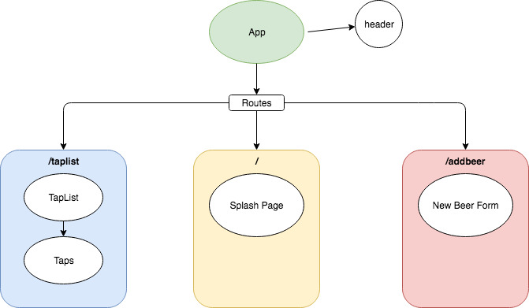

# _McShane's Taproom_

#### _A react application for my fictional English-style pub; 15-November-2019_

#### By _**Mike McShane**_

## Description

_A react application for my fictional English Pub McShane's. This project is currently in development still. Initial components, styling, and routing have been added._

## Component and Route Structure

## Setup/Installation Requirements_

* _Clone this repository from https://github.com/mmcshane10/TapRoom.git
* _From the project's root directory, run "npm install" in the terminal._
* _From the project's root directory, run "npm run start" in the terminal._

## Known Bugs

_No known bugs at this time, but also no functionality at this current point._

## Support and contact details

mmcshane10@gmail.com

## Technologies Used

_React, Webpack, JSX, JavaScript, npm_

### License

*open source*

Copyright (c) 2019 **_Mike McShane_**